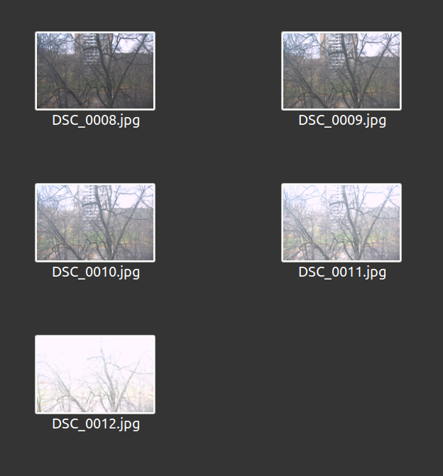

# Rate images by exposure
Assuming incoming numpy array is a 2D array of not processed Bayer image.  
Taken every other pixel of every other row (upper left in Bayer mask) to take into account light intensity under same filter

Experiments with RAW images show that:
 - [skewness](https://en.wikipedia.org/wiki/Skewness) less than `-1` reliably indicates too bright images and   
 - larger than `1` reliably indicates too dark images.  

Both are not affected by 'salt-like' noise  

## Compensate very dark or light images
Image can have `skew == 0` but all pixels under `100` or over `50000` (for 16 bits)  
Method `extend_range_to_max()` adds 2 pixels — `0` and maximum possible value to compensate bias

# Solution
```python
# solution.py
def rate_image(raw_image, max=None):
    flat = raw_image[::2,::2].flatten(order='C')
    if not max:
        max = get_max(flat.dtype)
    flat = extend_range_to_max(flat, max)
    
    skew = pd.Series(flat).skew()
    if skew < -1:
        return 'Overlight'
    elif skew > 1:
        return 'Underlight'
    else:
        return 'Normal'
```

## Run solution.py
`$ git clone https://github.com/efojs/rate_image.git`  
`$ pipenv sync`  
`$ python solution.py`  

## Results
```
DSC_0008.NEF Underlight
DSC_0009.NEF Underlight
DSC_0010.NEF Normal
DSC_0011.NEF Normal
DSC_0012.NEF Overlight
```

## Source images

